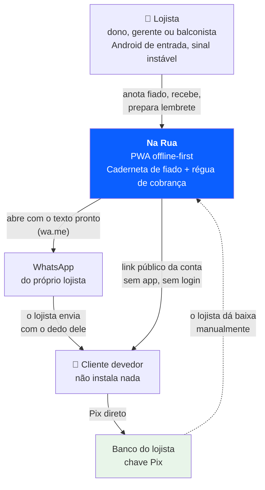
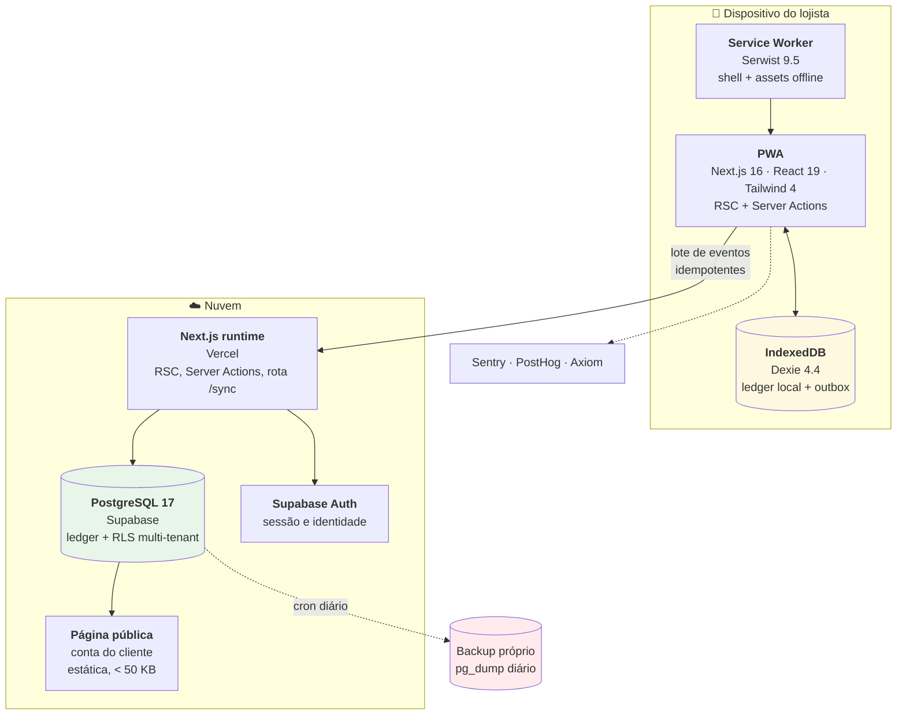
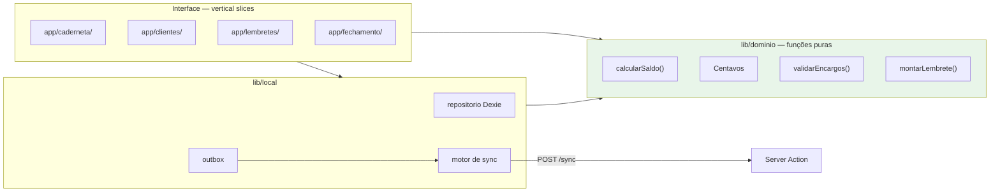
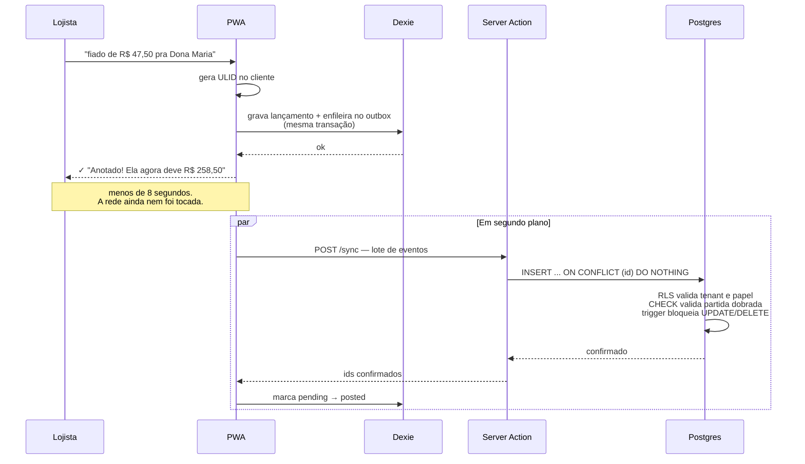

# Visão geral da arquitetura (C4)

> Fundamentação completa em [pesquisa técnica](00-pesquisa-tecnica.md). Decisões individuais em [ADRs](../05-adr/).

## A tese arquitetural, em uma frase

> **Sincronize eventos, nunca estado. Derive o saldo, nunca o transmita.**

Um ledger append-only com IDs idempotentes gerados no cliente resolve, com um único mecanismo, três problemas que normalmente exigem três soluções: **integridade contábil**, **auditoria** e **sincronização offline sem conflito**.

É essa decisão que torna desnecessário adotar um sync engine de terceiros — num mercado que está se consolidando por aquisição (Triplit→Supabase, Instant→OpenAI, Electric→Databricks).

---

## Nível 1 — Contexto

**Duas ausências deliberadas neste diagrama:**

1. **O dinheiro nunca passa pelo Na Rua.** O Pix vai direto do cliente para a chave do lojista. Isso mantém o produto fora do enquadramento como instituição de pagamento (Resolução BCB nº 80/2021).
2. **Nenhuma seta automática do Na Rua para o cliente.** Toda comunicação passa pelo WhatsApp do lojista, com ele apertando enviar. É trava de produto, não limitação técnica.

---

## Nível 2 — Contêineres

### Por que cada peça

| Contêiner | Escolha | Alternativas rejeitadas | ADR |
|---|---|---|---|
| Service worker | **Serwist 9.5.12** | `next-pwa` (morto desde 2022), `@ducanh2912/next-pwa` (dormente, o autor manda migrar), SW manual | [0013](../05-adr/0013-service-worker-serwist.md) |
| Banco local + sync | **Dexie + outbox próprio** | PowerSync, Zero, Dexie Cloud, RxDB, ElectricSQL, Legend-State, WatermelonDB | [0003](../05-adr/0003-dexie-outbox-proprio.md) |
| Backend | **Supabase (Postgres 17)** | Neon, Convex, Firebase, Cloudflare D1+DO, Turso | [0012](../05-adr/0012-backend-supabase.md) |
| ORM | **Drizzle 0.45.2** | Prisma 8 (RC), Drizzle 1.0-rc, SQL puro | [0018](../05-adr/0018-orm-drizzle.md) |
| Renderização | **RSC + streaming** | SPA client-side "porque é PWA" | [0016](../05-adr/0016-rsc-nao-spa.md) |

> ⚠️ **Backup próprio é contêiner de primeira classe neste diagrama, não detalhe operacional.** O plano gratuito do Supabase **não tem backup nenhum**, e o produto guarda o dinheiro de terceiros. `pg_dump` diário desde o primeiro dia com dado real. Ver [ADR-0024](../05-adr/0024-backup-proprio.md).

---

## Nível 3 — Componentes internos do PWA

**O núcleo de domínio é uma pasta, não quatro camadas.** Funções puras, sem I/O, sem React, sem Drizzle. Isso entrega o benefício real da arquitetura hexagonal — o domínio testável em isolamento — sem nenhuma interface, container de DI ou repositório genérico. Ver [ADR-0020](../05-adr/0020-vertical-slices.md).

---

## O fluxo que importa — anotar um fiado

**Três propriedades caem de graça:**

1. **A UI nunca espera a rede.** O lançamento está salvo antes de qualquer request.
2. **Reenvio é inofensivo.** Toque duplo, retry automático, sinal oscilando — tudo colapsa no mesmo ID.
3. **Dois balconistas offline não conflitam.** Ambos os lançamentos entram e somam. Ver [sincronização offline](04-sincronizacao-offline.md).

---

## As quatro restrições que moldaram tudo

| # | Restrição | Consequência arquitetural |
|---|---|---|
| 1 | **Perder dado é fatal** — causa nº 1 de desinstalação em 3 países | Ledger append-only forçado em **três camadas independentes**: grants, trigger e FORCE RLS |
| 2 | **A rede é indisponível com frequência**, e o Background Sync tem 78% de suporte e **zero no iOS** | Sync disparado pelo ciclo de vida do app (abertura, `visibilitychange`, evento `online`, retry) — nunca dependente de Background Sync |
| 3 | **É dinheiro de terceiros, num app feito por uma pessoa** | Isolamento garantido **no banco** (RLS), não no código de aplicação. Um `if` esquecido não pode vazar crédito de vizinho |
| 4 | **Android de entrada em 4G ruim** | RSC por padrão, orçamento de **≤ 170 KB de JS** na primeira carga, zero fonte web, `"use client"` só em folhas |

---

## O que foi deliberadamente rejeitado

| Rejeitado | Por quê |
|---|---|
| Hexagonal completo / Clean Architecture | O benefício é de **colaboração entre times**. Não existe com um dev. Todo custo, zero benefício |
| CQRS com barramento | Fowler é explícito: *"you should be very cautious about using CQRS"* em domínio CRUD |
| Event Sourcing "de verdade" | Ledger ≠ event sourcing. Ledger são **fatos de negócio** que já são a linguagem do domínio. Event sourcing é infraestrutura: versionamento de schema, projeções, replay |
| Repository genérico sobre Drizzle | O Drizzle já é a abstração sobre SQL. Envolvê-lo perde type-safety e não ganha nada |
| CRDT no dinheiro | Converge, mas **não garante invariantes**. Ver [ledger e integridade](03-ledger-e-integridade.md) |
| Sync engine de terceiros | O ledger elimina 95% do que ele resolve, e nenhum free tier serve |
| Monorepo / Turborepo | Um app, um deploy, um dev. É decoração |
| SPA client-side | SPAs geram ~1 soft navigation por hard navigation (RUM Archive). O JS extra não se paga |

> **O critério:** um revisor sênior pergunta duas coisas — *esse dev sabe onde está a complexidade real do domínio dele?* e *ele resistiu à tentação de aplicar padrão que não precisava?*
>
> A complexidade real está em três lugares: **dinheiro**, **isolamento multi-tenant** e **duas fontes de verdade**. Camada gasta em outra coisa é camada roubada dessas três.

---

## Custo de infraestrutura

| Fase | Custo/mês |
|---|---|
| Portfólio, sem faturar | **R$ 0** |
| A partir do primeiro cliente pagante | **~US$ 45** (Supabase Pro $25 + Vercel Pro $20) |

⚠️ A Vercel Hobby **proíbe uso comercial**, e a definição inclui pedir doações. Migrar para Pro é obrigatório **antes** do primeiro faturamento. Ver [ADR-0023](../05-adr/0023-vercel-pro-ao-faturar.md).
