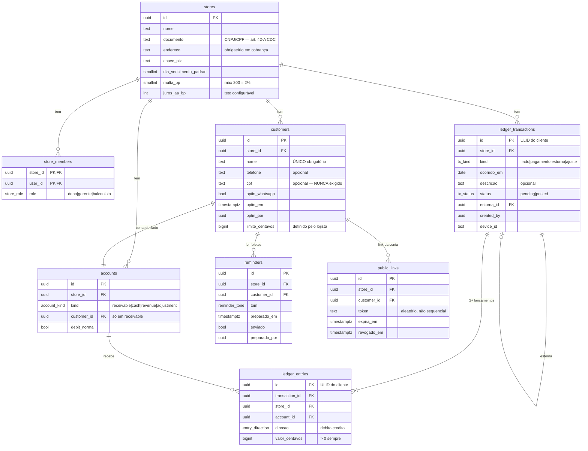

# Modelo de dados

> DDL de referência. Fundamentação em [pesquisa técnica](00-pesquisa-tecnica.md); invariantes em [regras de negócio](../03-produto/02-regras-de-negocio.md).

## Diagrama



---

## Princípios que o schema força

| # | Princípio | Como é forçado |
|---|---|---|
| 1 | **Nenhum float toca dinheiro** | `bigint` em centavos, sempre |
| 2 | **Nada é deletado nem atualizado no ledger** | Grants + trigger + FORCE RLS — três camadas independentes |
| 3 | **Toda transação equilibra** | Constraint deferrable por `transaction_id` |
| 4 | **Todo dado pertence a um tenant** | `store_id` em toda tabela, com RLS |
| 5 | **Quem fez fica na própria linha** | `created_by` no lançamento, não em log separado |
| 6 | **CPF é opcional em todo lugar** | Coluna nullable, sem constraint que a exija |
| 7 | **IDs vêm do cliente** | ULID/UUIDv7 gerado no dispositivo, antes da rede |

---

## DDL de referência

### Tipos e loja

```sql
create type store_role       as enum ('balconista', 'gerente', 'dono');
create type account_kind     as enum ('receivable', 'cash', 'revenue', 'adjustment');
create type tx_kind          as enum ('fiado', 'pagamento', 'estorno', 'ajuste');
create type tx_status        as enum ('pending', 'posted');
create type entry_direction  as enum ('debito', 'credito');
create type reminder_tone    as enum ('leve', 'direto', 'so_valor');

create table public.stores (
  id                     uuid primary key default gen_random_uuid(),
  nome                   text not null,
  -- Exigidos pelo CDC art. 42-A em todo documento de cobrança
  documento              text,
  endereco               text,
  chave_pix              text,
  dia_vencimento_padrao  smallint check (dia_vencimento_padrao between 1 and 31),
  -- Encargos: opt-in do lojista, com teto legal no schema
  multa_bp               int not null default 0
                         check (multa_bp between 0 and 200),   -- 2% — CDC art. 52 §1º
  juros_aa_bp            int not null default 0
                         check (juros_aa_bp between 0 and 1200), -- 12% a.a. — STJ REsp 1.720.656
  criado_em              timestamptz not null default now()
);
```

> O teto de multa **vive no schema**, não só na interface. Uma validação que só existe no front-end não é uma regra de negócio — é uma sugestão.

### Membros e papéis

```sql
create table public.store_members (
  store_id  uuid not null references public.stores(id) on delete cascade,
  user_id   uuid not null references auth.users(id)    on delete cascade,
  role      store_role not null,
  criado_em timestamptz not null default now(),
  primary key (store_id, user_id)
);

create index on public.store_members (user_id);
```

O papel **nunca vai para o JWT**. É lido daqui a cada verificação, via função `SECURITY DEFINER`. Custa uma leitura indexada e dá **revogação instantânea** — o dono demite o balconista às 14h e o acesso morre às 14h, não quando o token expirar. Ver [ADR-0008](../05-adr/0008-papel-fora-do-jwt.md).

### Clientes — o schema da minimização

```sql
create table public.customers (
  id             uuid primary key,             -- ULID gerado no cliente
  store_id       uuid not null references public.stores(id) on delete cascade,

  nome           text not null,                -- ÚNICO campo obrigatório
  telefone       text,                         -- opcional
  cpf            text,                         -- opcional. NUNCA exigido pelo produto

  optin_whatsapp boolean not null default false,
  optin_em       timestamptz,
  optin_por      uuid,

  limite_centavos bigint check (limite_centavos is null or limite_centavos > 0),
  dia_vencimento  smallint check (dia_vencimento between 1 and 31),

  anonimizado_em timestamptz,                  -- LGPD art. 18: apaga o dado, preserva o ledger
  criado_em      timestamptz not null default now(),
  created_by     uuid not null default auth.uid()
);

create index on public.customers (store_id);
create unique index on public.customers (store_id, lower(nome))
  where anonimizado_em is null;
```

**Duas decisões de privacidade visíveis no DDL:**

1. **Não existem colunas** para RG, foto de documento, comprovante de renda, local de trabalho ou "contato de referência". Não é omissão — é [decisão de escopo permanente](../00-visao/03-escopo.md). Todos são excessivos e são vetores clássicos de cobrança vexatória.
2. **O índice único é por `(store_id, nome)`, nunca global.** Unique global vazaria a existência de dado de outro tenant através do erro de duplicidade.

### Contas contábeis

```sql
create table public.accounts (
  id           uuid primary key default gen_random_uuid(),
  store_id     uuid not null references public.stores(id) on delete cascade,
  kind         account_kind not null,
  customer_id  uuid references public.customers(id),
  debit_normal boolean not null,
  constraint receivable_tem_cliente check (
    (kind = 'receivable' and customer_id is not null) or
    (kind <> 'receivable' and customer_id is null)
  )
);

create unique index on public.accounts (store_id, customer_id)
  where kind = 'receivable';
create index on public.accounts (store_id, kind);
```

| Conta | Natureza | Papel |
|---|---|---|
| `receivable:<cliente>` | débito | O que aquele freguês deve |
| `cash` | débito | Entrou dinheiro |
| `revenue` | crédito | Venda realizada |
| `adjustment` | crédito | Contrapartida de ajuste e estorno |

### Transações e lançamentos — o coração

```sql
create table public.ledger_transactions (
  id           uuid primary key,               -- ULID do cliente → idempotência
  store_id     uuid not null references public.stores(id) on delete cascade,
  kind         tx_kind not null,
  ocorrido_em  date not null,
  descricao    text,                           -- sempre opcional
  status       tx_status not null default 'pending',
  estorna_id   uuid references public.ledger_transactions(id),
  contestada   boolean not null default false, -- CDC art. 54-G: suspende lembretes
  created_by   uuid not null default auth.uid(),
  device_id    text,
  criado_em    timestamptz not null default now(),
  constraint sem_data_futura check (ocorrido_em <= current_date)
);

create table public.ledger_entries (
  id             uuid primary key,             -- ULID do cliente
  transaction_id uuid not null references public.ledger_transactions(id),
  store_id       uuid not null references public.stores(id) on delete cascade,
  account_id     uuid not null references public.accounts(id),
  direcao        entry_direction not null,
  valor_centavos bigint not null check (valor_centavos > 0),
  criado_em      timestamptz not null default now()
);

create index on public.ledger_entries (store_id, account_id);
create index on public.ledger_entries (transaction_id);
create index on public.ledger_transactions (store_id, ocorrido_em desc);
```

### A constraint que impede criar ou destruir dinheiro

```sql
create or replace function private.transacao_equilibrada()
returns trigger language plpgsql as $$
declare
  d bigint; c bigint;
begin
  select
    coalesce(sum(valor_centavos) filter (where direcao = 'debito'),  0),
    coalesce(sum(valor_centavos) filter (where direcao = 'credito'), 0)
  into d, c
  from public.ledger_entries
  where transaction_id = coalesce(new.transaction_id, old.transaction_id);

  if d <> c then
    raise exception
      'Partida dobrada violada na transação %: débitos=% créditos=%',
      coalesce(new.transaction_id, old.transaction_id), d, c;
  end if;
  return null;
end; $$;

create constraint trigger tg_transacao_equilibrada
  after insert on public.ledger_entries
  deferrable initially deferred
  for each row execute function private.transacao_equilibrada();
```

`deferrable initially deferred` é essencial: a verificação roda **no commit**, permitindo inserir os dois lados da partida na mesma transação.

### Append-only em três camadas independentes

```sql
-- 1) A API simplesmente não tem o verbo
revoke update, delete on public.ledger_entries, public.ledger_transactions
  from authenticated, anon;
grant  select, insert on public.ledger_entries, public.ledger_transactions
  to authenticated;

-- 2) Trigger: barra até quem tem privilégio (service_role, migrações, você às 3h)
create or replace function private.deny_mutation()
returns trigger language plpgsql as $$
begin
  raise exception 'ledger é append-only (operação: %)', tg_op;
end; $$;

create trigger tg_ledger_entries_imutavel
  before update or delete on public.ledger_entries
  for each row execute function private.deny_mutation();

-- 3) RLS forçada, inclusive para o owner da tabela
alter table public.ledger_entries      enable row level security;
alter table public.ledger_entries      force  row level security;
alter table public.ledger_transactions enable row level security;
alter table public.ledger_transactions force  row level security;
```

**Uma camada sempre falha.** Grants sozinhos não param o `service_role`. Trigger sozinho não impede quem desabilita triggers. RLS sozinha é ignorada pelo owner da tabela. As três juntas tornam a imutabilidade inviolável **pelo próprio código de aplicação** — que é exatamente a garantia que um dev solo precisa ter.

Ver [ADR-0006](../05-adr/0006-append-only-tres-camadas.md).

### Saldo — derivado, sempre

```sql
create or replace view public.v_saldos
with (security_invoker = on) as            -- ⚠️ NUNCA omitir. Ver ADR-0010
select
  e.store_id,
  a.customer_id,
  sum(case when e.direcao = 'debito'  then  e.valor_centavos
           when e.direcao = 'credito' then -e.valor_centavos end) as saldo_centavos
from public.ledger_entries e
join public.accounts a on a.id = e.account_id
where a.kind = 'receivable'
group by e.store_id, a.customer_id;
```

> 🔴 **`security_invoker = on` não é opcional.** Por padrão, o Postgres aplica as policies do **owner** da view. Como views no Supabase são criadas pelo `postgres`, uma view sem essa opção sobre tabela com RLS **entrega todos os tenants para todo mundo, silenciosamente**. É o footgun mais perigoso da stack.

**Somar é a estratégia correta neste volume.** Uma caderneta de bairro tem centenas de lançamentos por cliente, não milhões — `SUM()` com índice em `(store_id, account_id)` resolve em microssegundos.

Coluna cacheada só quando o `EXPLAIN ANALYZE` provar necessidade — e o **job de reconciliação entra no mesmo commit**. Cache de saldo sem reconciliação é dívida técnica que cobra juros em dinheiro real.

### Lembretes — a prova de defesa

```sql
create table public.reminders (
  id            uuid primary key,
  store_id      uuid not null references public.stores(id) on delete cascade,
  customer_id   uuid not null references public.customers(id),
  tom           reminder_tone not null,
  texto         text not null,               -- exatamente o que foi preparado
  preparado_em  timestamptz not null default now(),
  preparado_por uuid not null default auth.uid(),
  enviado       boolean not null default false
);

create index on public.reminders (store_id, customer_id, preparado_em desc);
```

Registrar **o que foi preparado, quando, para quem e por quem** é exigência do art. 37 da LGPD (registro de operações, obrigatório quando o tratamento se baseia em legítimo interesse). E é a prova de defesa do lojista se ele for acusado de cobrança abusiva.

O campo `enviado` também é métrica de produto: **lembretes gerados e não enviados são o sinal mais honesto de desconforto do lojista com o tom**.

### Link público

```sql
create table public.public_links (
  id          uuid primary key default gen_random_uuid(),
  store_id    uuid not null references public.stores(id) on delete cascade,
  customer_id uuid not null references public.customers(id),
  token       text not null unique,          -- aleatório longo, nunca sequencial
  expira_em   timestamptz not null default now() + interval '30 days',
  revogado_em timestamptz
);
```

Token aleatório longo evita enumeração. Expiração e revogação atendem à minimização da LGPD.

---

## Espelho local (Dexie)

```ts
db.version(1).stores({
  customers:    'id, store_id, nome',
  transactions: 'id, store_id, ocorrido_em, status',
  entries:      'id, transaction_id, store_id, account_id',
  outbox:       '++seq, tx_id, tentativas',   // fila de mutações
  meta:         'chave'                        // último sync, device_id
})
```

O schema local **espelha o remoto**, com uma tabela a mais: o `outbox`. Ver [sincronização offline](04-sincronizacao-offline.md).

---

## Retenção e o direito de eliminação

O pedido de eliminação do titular (LGPD art. 18) **não pode quebrar a contabilidade**. A solução:

```sql
-- Anonimiza a pessoa. Preserva o fato contábil.
update public.customers
   set nome = 'Cliente removido',
       telefone = null,
       cpf = null,
       anonimizado_em = now()
 where id = $1;
```

Os lançamentos permanecem — sem identificação. O saldo da loja continua batendo, o histórico agregado sobrevive, e o dado pessoal desaparece. É o único desenho que satisfaz simultaneamente o art. 18 da LGPD e a integridade do ledger.
