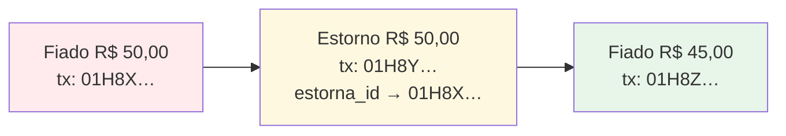

# Ledger e integridade contábil

> A decisão que carrega o projeto inteiro. Fundamentação em [pesquisa técnica](00-pesquisa-tecnica.md) §3.

## Por que uma caderneta de bairro precisa de contabilidade de verdade

Parece exagero. Não é. O domínio tem crédito concedido, pagamento parcial, estorno, crédito a favor do cliente, desconto, e **um número que não pode dar errado** — porque esse número é dinheiro que o lojista tem a receber.

E há um agravante que sistemas financeiros normais não têm: **duas fontes de verdade**. O celular do lojista e o servidor. Isso transforma "somar valores" num problema de sistemas distribuídos.

---

## Partidas dobradas

O princípio, na formulação da Modern Treasury: *"every transaction should record both where the money came from and what the money was used for."*

| Conta | Natureza | Aumenta com |
|---|---|---|
| `receivable:<cliente>` | **débito** | débito |
| `cash` | **débito** | débito |
| `revenue` | **crédito** | crédito |
| `adjustment` | **crédito** | crédito |

### Os três eventos do domínio

**Fiado de R$ 47,50 para a Dona Maria**
```
DÉBITO   receivable:maria     4750    (ela passa a dever mais)
CRÉDITO  revenue              4750    (a loja vendeu)
```

**Pagamento de R$ 20,00**
```
DÉBITO   cash                 2000    (entrou dinheiro no caixa)
CRÉDITO  receivable:maria     2000    (ela passa a dever menos)
```

**Estorno de um fiado lançado errado**
```
CRÉDITO  receivable:maria     4750    (desfaz o débito)
DÉBITO   adjustment           4750
```

O saldo da Dona Maria é o saldo da conta `receivable:maria`. E existe uma verificação estrutural gratuita:

> **A soma de todos os débitos tem que ser igual à soma de todos os créditos. Se não for, o sistema criou ou destruiu dinheiro — e isso é bug, descoberto no ato e não no fim do mês.**

**Single-entry funcionaria?** Funcionaria. Uma coluna `valor` com sinal resolve. Mas perde a validação estrutural gratuita e perde a capacidade de responder "de onde veio esse dinheiro". A Square construiu o "Books" exatamente com partidas dobradas, descrevendo-o como *"a well-established, public-domain, battle-tested approach to modeling financials"*.

---

## Imutabilidade

> **"Immutability is the most important guarantee from a ledger."** — Modern Treasury

Três razões, e a terceira é a que decide:

1. **Auditoria.** O lojista precisa explicar o extrato para o freguês, linha a linha, incluindo os erros e as correções.
2. **Sem race condition.** Não existe UPDATE concorrente sobre uma coluna de saldo, porque não existe coluna de saldo.
3. **⭐ Sincronização vira união de conjuntos.** Um conjunto append-only de lançamentos imutáveis com IDs únicos é um **G-Set** — o merge é união, que é comutativa, associativa e idempotente. Converge sozinho, sem nenhuma lógica de resolução de conflito.

A terceira razão é o motivo pelo qual este projeto **não precisa de sync engine**.

---

## Estorno: nunca deletar, sempre contra-lançar

Do TigerBeetle: para corrigir uma transferência, você *"submit two additional transfers going in the opposite direction"*. E a observação que fecha o argumento:

> *"A correcting entry might even be wrong, in which case it itself can be corrected with yet another transfer."*

**Estratégia adotada: reversal completo, não delta.**

O lojista precisa conseguir explicar o extrato para o cliente. `R$ 50 − R$ 50 + R$ 45` é legível; `R$ 50 − R$ 5` não é — parece que ele deu um desconto que ninguém combinou.



O `estorna_id` mantém a cadeia rastreável. **Na interface, o lojista vê "corrigir". No ledger, acontece um contra-lançamento.** Ele nunca precisa saber a diferença.

---

## Pending e posted — onde a contabilidade encontra o offline

> *"A ledger transaction is mutable while pending and immutable once posted."*

Este mapeamento é fortuito e perfeito:

| Estado | Significado no Na Rua |
|---|---|
| **`pending`** | Criado no dispositivo, ainda não confirmado pelo servidor |
| **`posted`** | Confirmado pelo Postgres |

O lojista vê o saldo **incluindo os pendentes** — porque é com esse número que ele toma decisão no balcão.

> ⚠️ **Mas a interface não marca o item como pendente na lista.** Ver [princípio P11](../02-ux/01-principios-de-design.md): item offline acinzentado ensina o lojista a desconfiar do app, e desconfiança significa manter o caderno em paralelo. O estado da **conexão** é comunicado uma vez, no topo. O **lançamento** está salvo e é tratado como salvo.

---

## Por que CRDT está errado aqui — e por que a solução certa é um CRDT

Esta seção existe porque a resposta é mais interessante que "cuidado com CRDT".

### O problema formal

CRDTs garantem *strong eventual consistency*: réplicas que receberam o mesmo conjunto de operações convergem. Eles **não garantem invariantes de aplicação**. A literatura é clara: invariantes precisam valer também **após o merge**, e forçá-los exige sincronização adicional — que é exatamente o que o CRDT existe para evitar.

### O caso concreto

Dona Maria tem saldo 100 e limite 120.

- Balconista A, offline, registra compra de 50 → saldo 150
- Balconista B, offline, registra compra de 40 → saldo 140

| Modelo | Resultado do merge | Problema |
|---|---|---|
| **LWW no campo `saldo`** | 150 **ou** 140 | 🔴 **Uma das compras evaporou.** A loja perdeu dinheiro real, e o sistema convergiu lindamente para um número errado — sem erro em lugar nenhum |
| **PN-Counter CRDT** | 190 ✅ | Correto. Mas o limite de 120 foi violado e **nenhuma réplica jamais teve a informação necessária para impedir** |
| **Ledger append-only** | 190 ✅ | Correto por construção. E o estouro vira **alerta para o dono**, não rollback silencioso |

Invariante de desigualdade (`saldo ≤ limite`) é o exemplo canônico do que CRDT não sabe garantir sem coordenação.

### A conclusão

| Camada | CRDT serve? |
|---|---|
| Texto colaborativo, ordem de lista, presença | ✅ É o caso de uso |
| **Registro de fatos que aconteceram** | ✅ **Sim — um grow-only set de eventos é literalmente um CRDT** |
| **Saldo, limite, autorização** | 🔴 **Não. Nunca.** |

> **A solução certa é, ela própria, um CRDT — só que no lugar certo.** Você nunca sincroniza o *saldo*. Sincroniza os *fatos* e recalcula.

### E o limite de crédito, então?

Autorizar contra limite **não pode ser decidido offline com garantia**. O produto é honesto sobre isso:

1. Valida contra o saldo local conhecido
2. Marca o lançamento como provisório
3. O servidor é a autoridade final
4. Se estourar na sincronização, **avisa o dono**

E, por decisão de produto, [o limite avisa e nunca bloqueia](../03-produto/02-regras-de-negocio.md) — o que também evita configurar decisão automatizada de crédito (LGPD art. 20).

> **Rollback silencioso de dinheiro é pior que estouro de limite.**

---

## Valores em centavos

```
R$ 47,50  →  4750   (bigint)
```

Nunca `float`, nunca `real`, nunca `numeric` de reais.

`0.1 + 0.2 !== 0.3` é uma curiosidade num tweet e é um processo no Procon numa caderneta. E há evidência de campo: uma review real de concorrente relata arredondamento errado —
> *"quando você coloca um valor por exemplo 518,44 ele coloca 518,45"*

Isso destrói a confiança na ferramenta inteira. Ver [ADR-0005](../05-adr/0005-valores-em-centavos.md).

**Onde a conversão acontece:** exatamente uma vez, na borda da interface. O tipo `Centavos` do domínio nunca aceita um número de reais.

---

## Auditoria é o ledger

Não é log, não é trigger, não é extensão.

| Abordagem | Captura `auth.uid()` | Transacional | Consultável | Status |
|---|---|---|---|---|
| `supa_audit` | Não nativamente | ✅ | ✅ | 🔴 **Arquivado em 16/02/2025** |
| `pgaudit` | ❌ **só role Postgres** | ❌ *"best-effort and not transactional"* | ❌ só logs | Ativo, mas inadequado |
| **Ledger** | ✅ **por design** | ✅ | ✅ | ✅ |

`created_by uuid not null default auth.uid()` **na própria linha do lançamento**: transacional, consultável por SQL, imune a política de retenção de log (o plano gratuito do Supabase guarda logs por **1 dia**), e responde exatamente a pergunta do negócio: *"quem lançou este fiado?"*.

> **Trilha de auditoria não deve ser subproduto. Deve ser o modelo de dados.**

---

## Reconciliação

Mesmo com saldo derivado, é preciso verificar que o ledger não desandou. Job diário:

```sql
-- Nenhuma transação desequilibrada
select transaction_id,
       sum(valor_centavos) filter (where direcao='debito')  as d,
       sum(valor_centavos) filter (where direcao='credito') as c
from public.ledger_entries
group by transaction_id
having sum(valor_centavos) filter (where direcao='debito')
    <> sum(valor_centavos) filter (where direcao='credito');
-- Espera-se: zero linhas.
```

Ver [invariantes verificáveis](../03-produto/02-regras-de-negocio.md#10-invariantes-verificáveis) — as dez asserções que os testes rodam contra o banco.

---

## Ledger não é Event Sourcing

Distinção que importa, e que costuma ser confundida:

| | Ledger | Event Sourcing |
|---|---|---|
| O que armazena | **Fatos de negócio** que já são a linguagem do domínio | O estado da aplicação inteira, reconstruído de eventos |
| Vocabulário | "um pagamento aconteceu" | "`CustomerCreditLimitChangedEvent` v3" |
| Custo | Baixo — é o que o domínio pede | Alto: versionamento de schema, projeções, replay |
| Integração externa | Trivial | Problema sério — replay dispara notificação duplicada |
| Veredito aqui | ✅ **Fazer** | ❌ **Não fazer** |

Fowler lista os custos do Event Sourcing: integração com sistemas externos vira problema difícil, e a evolução de código versus replay *"fica muito bagunçado"*.

**O primeiro é contabilidade. O segundo é infraestrutura. Faça o primeiro.**
