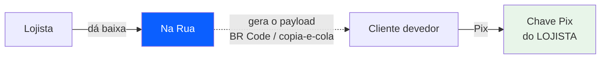

# Integrações

> Fundamentação em [pesquisa regulatória](../06-compliance/00-pesquisa-regulatoria.md) §4 e §5, e em [pesquisa de mercado](../01-pesquisa/00-pesquisa-de-mercado.md).

## O princípio

> **O dinheiro nunca entra no Na Rua. O dado pessoal nunca sai do Na Rua. O humano fica no loop da cobrança.**

As três integrações do produto — Pix, WhatsApp e nota fiscal — foram desenhadas em torno dessa frase. E, nos três casos, a opção mais simples também é a mais barata **e** a de menor exposição regulatória. Isso não é coincidência: é o que acontece quando se desenha a partir da restrição em vez de contra ela.

---

## Pix — direto na chave do lojista

O Na Rua gera o payload do QR Code apontando para a **chave do próprio lojista**. O dinheiro nunca entra em conta nossa.

### Por que esta arquitetura

**Regulatoriamente:** o SaaS não é instituição de pagamento, não é subcredenciador, não participa do arranjo Pix. É um software de gestão que gera um payload padronizado. Não há custódia, não há liquidação, não há saldo de terceiros. Custodiar dinheiro exigiria autorização prévia do BCB (Resolução nº 80/2021), capital mínimo, governança e PLD/FT — inviável para micro-SaaS.

**Economicamente — e este é o argumento decisivo.** O fiado tem ticket muito baixo (R$ 20 a R$ 150), o que **inverte a lógica normal de escolha de PSP**:

| Ticket | Asaas (R$ 1,99 fixo) | Efí (1,19%) | Pagar.me (0,78%) |
|---|---|---|---|
| R$ 30 | R$ 1,99 = **6,6%** 🔴 | R$ 0,36 | R$ 0,23 |
| R$ 100 | R$ 1,99 = 2,0% | R$ 1,19 | R$ 0,78 |
| R$ 500 | R$ 1,99 = 0,4% | R$ 5,95 | R$ 3,90 |

**Um Pix de R$ 30 no Asaas custaria 6,6%.** Isso mata a economia do produto. Pix direto na chave do lojista custa **zero** para nós e praticamente zero para ele.

### O trade-off honesto

| | |
|---|---|
| ➖ **Conciliação é manual** | Sem acesso ao extrato, não sabemos automaticamente que o Pix caiu. **No MVP o lojista dá baixa** — é simples e funciona |
| ➖ Sem taxa de transação | O produto monetiza **só por assinatura**. É escolha de modelo de negócio, não só de arquitetura |
| ➕ Zero chargeback, zero custódia, zero PCI, zero KYC | |

### QR simples vs. QR com vencimento

| | Quando usar |
|---|---|
| **COB (sem vencimento)** | Padrão. Não exige CPF do devedor |
| **COBV (com vencimento)** | Só quando o lojista optar por encargos **e** tiver o CPF. O QR embute multa, juros, desconto e abatimento, e o PSP calcula o valor final no pagamento |

> ⚠️ O objeto `cobv` da API Pix exige CPF/CNPJ no campo `devedor`. Isso conflita com a [decisão de não coletar CPF](../03-produto/02-regras-de-negocio.md). Por isso o produto suporta **os dois caminhos**, com COB como padrão.

### Pix Automático — roadmap, não MVP

Existe (Resolução BCB nº 402/2024, em produção desde 16/06/2025), mas:

- ✅ Faz sentido para: cliente recorrente que fecha a conta todo dia 5
- ❌ **Não faz sentido para o caso dominante do fiado**: valor irregular, data irregular, cliente sem saldo em conta. Pix Automático pressupõe conta bancária com saldo previsível — exatamente o que falta ao público
- 🔴 **Bloqueador prático:** o recebedor precisa ser **PJ com CNPJ ativo**, e segundo materiais de PSPs, ativo há mais de 6 meses. Isso exclui parte relevante do público-alvo

### Fase 2 opcional — PSP com conciliação automática

Se um lojista quiser conciliação automática e estiver disposto a pagar por ela, ela vira **upgrade opcional, nunca caminho obrigatório**. Nesse modelo o PSP (Asaas ou Pagar.me) abre **subconta em nome do lojista**, faz o KYC dele, e o dinheiro liquida na conta **dele**.

> ⚠️ Se o dinheiro passar por conta nossa, ou se houver escrow, a análise regulatória muda completamente. **Validar com advogado antes de ligar split.**

---

## WhatsApp — `wa.me` no MVP

### A decisão

O app monta `https://wa.me/55DDDNUMERO?text=<mensagem+urlencoded>`. O lojista toca, o WhatsApp dele abre com o texto pronto, ele confere e envia.

### Por que isso ganha de tudo

| Vantagem | Detalhe |
|---|---|
| **Custo R$ 0** | Nenhuma taxa Meta, nenhum BSP, nenhuma mensalidade |
| **Zero setup** | Sem verificação de negócio, sem WABA, sem aprovação de template, sem número dedicado. O lojista instala e usa **hoje** |
| **Risco de banimento zero** | É o WhatsApp normal dele. Recurso oficial e documentado |
| ⭐ **Vantagem de LGPD** | **Nenhum dado pessoal do devedor sai para a API da Meta.** Não há uso compartilhado nem transferência internacional promovida pelo produto — isso **elimina a Resolução ANPD 19/2024 do escopo do MVP inteiro** |
| ⭐ **Vantagem de CDC** | O lojista **lê a mensagem antes de mandar**. Há um humano no loop, o que reduz drasticamente o risco de cobrança vexatória automatizada |
| **Melhor conversão** | Vem do número que o cliente já conhece e confia, não de um número corporativo desconhecido |

### As desvantagens, e o que fazemos

| Desvantagem | Mitigação |
|---|---|
| Exige um toque do lojista | **Fila de cobrança do dia**: "5 pessoas para lembrar hoje", com botões grandes em sequência. 5 toques não é trabalho. E o lojista *quer* revisar antes de cobrar quem ele vê na rua |
| Não dá para agendar às 3h | **É vantagem disfarçada** — resolve o problema de janela de horário por construção |
| Sem confirmação de entrega | Aceitável. Rastreamos "preparado" e "marcado como enviado" |

### 🔴 API não-oficial: risco existencial

Evolution API em modo QR, Z-API, Baileys, WPPConnect — todas funcionam por engenharia reversa do WhatsApp Web e **violam os Termos de Serviço da Meta**. A Meta intensificou a fiscalização, com **bloqueios permanentes sem aviso prévio**.

> **Se o número do lojista for banido, ele perde o canal de contato com toda a clientela do bairro — um ativo que levou anos para construir.** Isso não é um bug: é destruição do negócio do cliente.

Ver [ADR-0014](../05-adr/0014-whatsapp-wa-me.md).

### Fase 3 — Cloud API oficial como upgrade pago

**Gatilho:** lojistas com mais de ~80–100 clientes fiado, para quem a fila manual vira trabalho real.

O modelo de preço da Meta mudou para **por mensagem em 01/07/2025**, e a regra que muda a conta:

| Categoria | Cobrança |
|---|---|
| **Utility** | Cobrada **apenas fora** da janela de atendimento de 24h. **Grátis dentro dela** |
| Marketing | Sempre cobrada, ~9× mais cara |
| Service (não-template, dentro da janela) | **Grátis** |

Lembrete de dívida é **utility** — notificação transacional sobre uma transação existente.

⭐ **Consequência de design:** o produto deve ser desenhado para **provocar resposta** (botões de resposta rápida: "Vou pagar hoje" / "Vou pagar dia X" / "Quero ver minha conta"). Cada resposta abre 24h de mensagens gratuitas. Isso simultaneamente melhora a recuperação, reduz o custo marginal, e evita a percepção de spam unilateral — o que protege a qualidade do número.

Custo modelado (utility a ~R$ 0,04, valor de fonte secundária — **não confirmado** no rate card oficial):

| Cenário | Lembretes/mês | Custo/mês |
|---|---|---|
| 40 clientes, 2 lembretes cada | 80 | ~R$ 3,20 |
| 150 clientes, 3 cada | 450 | ~R$ 18,00 |
| 400 clientes, 3 cada | 1.200 | ~R$ 48,00 |

> **O custo de mensageria nunca é o gargalo.** O gargalo é **complexidade de onboarding**: exigir que um dono de mercadinho passe por verificação de negócio da Meta antes de usar o produto é o que mata a ativação. `wa.me` remove essa fricção por completo.

### Requisitos da Fase 3

- **Opt-in registrado** com data, hora e usuário — o momento de cadastro do cliente é o momento de opt-in
- **Um número por lojista**, nunca número compartilhado da plataforma. Se um lojista abusar, ele não pode derrubar o número de todos
- **Monitorar o quality rating** via webhook e **pausar automaticamente** ao rebaixamento. Cobrança é intrinsecamente de alto risco de bloqueio — as pessoas bloqueiam quem cobra
- Templates rigorosamente transacionais. **Nenhuma frase promocional** — misturar cobrança com oferta reclassifica de utility para marketing

---

## Nota fiscal — não emitimos

**Registrar não é emitir.** O fato gerador do ICMS é a circulação da mercadoria, não o registro dela num software de gestão.

Emitir NFC-e a partir do SaaS exigiria: credenciamento em 27 SEFAZ, certificado digital A1 de cada lojista, homologação, contingência, gestão de rejeições, cancelamento e inutilização de numeração, e guarda de XML por 5 anos.

> **Isso é um produto inteiro, não uma feature.**

**Decisão:** não emitir. Se necessário no futuro, **integrar** com emissor existente (Focus NFe, TecnoSpeed, NFe.io, Bling, Tiny), deixando a responsabilidade fiscal e o certificado com o lojista.

⚠️ **Consequência contratual:** os Termos de Uso devem deixar explícito que o software **não é emissor de documento fiscal** e que a obrigação tributária permanece integralmente com o lojista.

### O que fazemos em vez disso

**Alerta de limite do MEI.** O app já conhece as vendas registradas: *"você já faturou R$ 68.000 este ano — atenção ao limite do MEI (R$ 81.000)"*. É utilidade concreta, barata de construir, e ninguém faz.

---

## Terceiros que recusamos

| Integração | Por quê |
|---|---|
| **Bureau de crédito** (Serasa, SPC, Boa Vista) | R$ 5–24 por consulta para decidir um fiado de R$ 50. E reposicionaria o produto como concessão de crédito |
| **Negativação** | Assimetria de risco brutal. Exige CPF + endereço + prova documental, revertendo toda a minimização de dados |
| **Antecipação de recebível** | Instituição regulada pelo BCB |
| **Adquirente / maquininha** | Fora de escopo. Não somos PDV |
| **Contabilidade** | Fora de escopo |

> ⭐ **Insight:** o dado de crédito mais valioso para este produto **é o que ele mesmo gera**. *"Este cliente pagou 12 de 14 vezes em dia"* é mais preditivo, mais barato, mais defensável juridicamente (base legal: execução de contrato) e mais útil que qualquer score externo. **E é grátis.**

---

## Mapa de subprocessadores

Exigência do art. 18, VII da LGPD — o titular pode exigir informação sobre com quem os dados foram compartilhados. Esta lista precisa estar **pública**.

| Serviço | Dado que recebe | Local | Fase |
|---|---|---|---|
| **Supabase** | Todos os dados da aplicação | ⚠️ escolher **região no Brasil** | MVP |
| **Vercel** | Requisições, logs de acesso | EUA | MVP |
| **Sentry** | Erros, session replay | EUA | MVP |
| **PostHog** | Eventos de produto, replay | EUA/UE | MVP |
| **Axiom** | Logs estruturados | EUA | MVP |
| **Meta / WhatsApp** | **Nenhum, no MVP** — `wa.me` não envia dado nosso | EUA | Fase 3 |
| **PSP** | Dados de cobrança, se o lojista optar | Brasil | Fase 2 |

**Hospedar o banco no Brasil não é obrigatório por lei**, mas elimina uma camada inteira de complexidade regulatória e é argumento de venda. É a escolha padrão.
